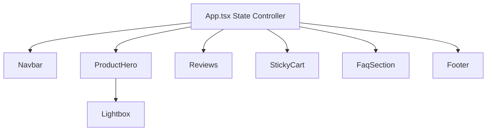

# Monolithic App Refactoring & Modular Component Structure

Refactoring the single-file [App.tsx](file:///d:/Troopod/src/App.tsx) into a structured folder layout. This improves code readability, testability, and conforms to standard production react structures suited for Vercel deployment.

## Proposed Component State Map

To keep the application simple and performant without introducing heavy state managers (like Redux or Context), we will lift shared state to `App.tsx` and pass them down via typed props.

*   `cartCount`: Shared between `Navbar` and `ProductHero`.
*   `reviews` / `addedRatings`: Shared between `ProductHero` (rating stars), `Reviews` (breakdowns & cards), and `StickyCart`.
*   `purchaseType` / `quantity`: Shared between `ProductHero` (the control selector) and `StickyCart` (to compute currentTotal).

---

## Proposed Changes

### Core Types & Static Data

#### [NEW] [index.ts](file:///d:/Troopod/src/types/index.ts)
Declares types to be shared between components.
*   `Review`: Defines the name, title, text, rating, verified badge, and date.
*   `Product`: Defines name, price, rating, reviews count, and image URL for related products.

#### [NEW] [productData.ts](file:///d:/Troopod/src/data/productData.ts)
Moves all hardcoded copy arrays out of components:
*   `faqs`: The list of questions and answers.
*   `relatedProducts`: Array of related item objects.
*   `gallery`: Array of product image URLs.

---

### Component Architecture

#### [NEW] [Navbar.tsx](file:///d:/Troopod/src/components/Navbar.tsx)
Extract navigation links, logo, and cart bag icon with `cartCount` prop indicator.

#### [NEW] [Lightbox.tsx](file:///d:/Troopod/src/components/Lightbox.tsx)
Handles the full-screen interactive view.
*   Props: `isOpen: boolean`, `imageIndex: number`, `onClose: () => void`, `onChangeIndex: (index: number) => void`.
*   Includes keyboard navigation and scroll lock effects.

#### [NEW] [ProductHero.tsx](file:///d:/Troopod/src/components/ProductHero.tsx)
Houses the gallery preview layout, purchase tier toggles, and quantity selectors.
*   Props: `averageRating: string`, `totalReviews: number`, `onAddToCart: (quantity: number) => void`, `purchaseType: 'onetime' | 'subscription'`, `setPurchaseType: (type: 'onetime' | 'subscription') => void`, `quantity: number`, `setQuantity: (q: number) => void`, `isAdding: boolean`.
*   Triggers the `Lightbox` open handler when clicking the main image.

#### [NEW] [Reviews.tsx](file:///d:/Troopod/src/components/Reviews.tsx)
Container for the testimonials section.
*   Props: `reviews: Review[]`, `averageRating: string`, `totalReviews: number`, `getPercent: (stars: 1|2|3|4|5) => number`, `onSubmitReview: (name: string, title: string, text: string, rating: number) => void`.

#### [NEW] [FaqSection.tsx](file:///d:/Troopod/src/components/FaqSection.tsx)
Accordion layout of questions and answers.

#### [NEW] [Footer.tsx](file:///d:/Troopod/src/components/Footer.tsx)
Standard HTML5 semantic footer.

---

### Core Controller

#### [MODIFY] [App.tsx](file:///d:/Troopod/src/App.tsx)
*   Remove all raw layouts and inline data arrays.
*   Maintain main shared states and coordinate prop bindings to sub-components.

---

## Verification Plan

### Automated Build Verification
*   We will run `pnpm run build` locally once the structure is completed to ensure zero TypeScript errors or lints occur.

### Manual Verification
*   Check the Figma Make preview panel to confirm navigation, image lightbox click, write-a-review inputs, subtotal calculation, and responsive styling render identically to the current layout.
